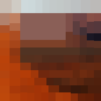
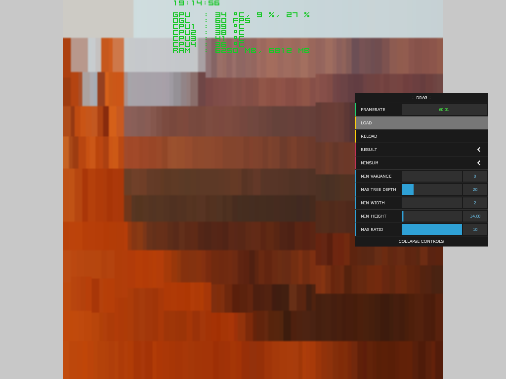
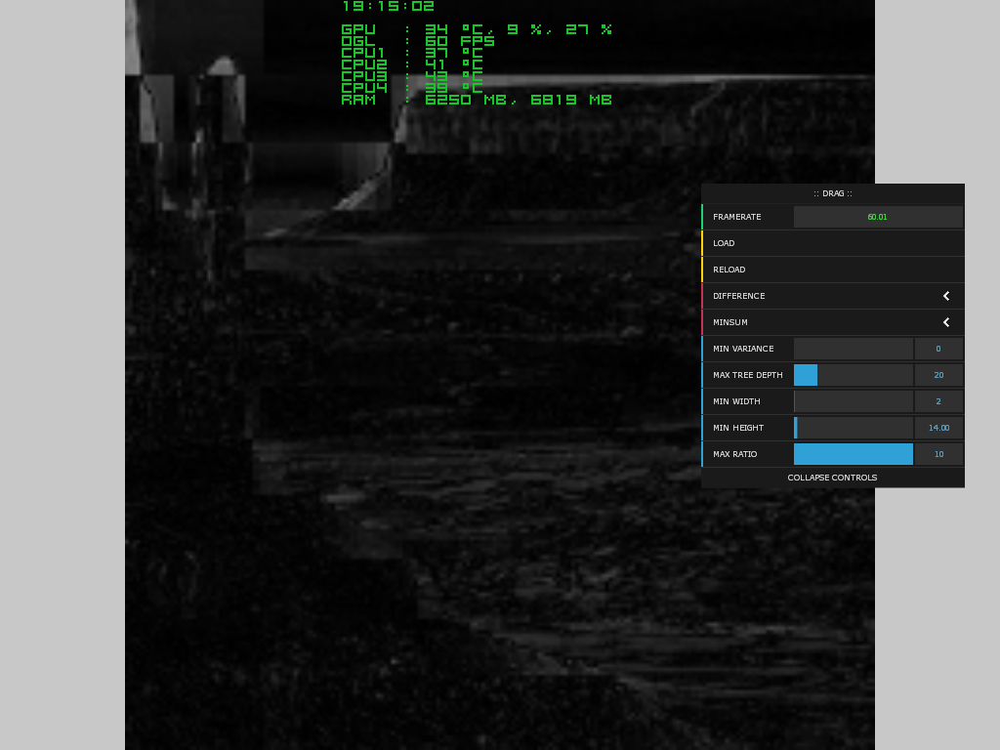

# KDTreeImage

This openframeworks (v0.10) app creates kd-tree from image. Kd-nodes created in a way, that minimizes result of expression from color variances and means of possible child rectangular nodes.  
Controls:  
h - hide gui panel  
s - save buffer with resulted image  
d - save window screenshot  
  
  
  
  
  
